<h3>Compte rendu<h3>
<h4>1-Créer l'interface IDao avec une méthode getDate</h4>
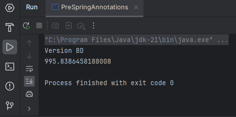
<h4>2-Créer une implémentation de cette interface </h4>
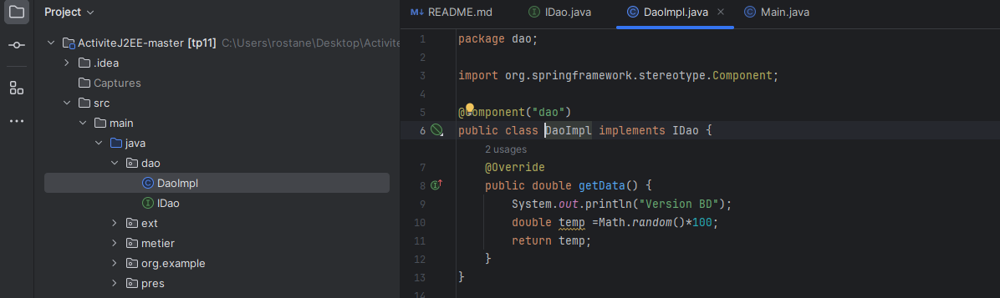
<h4>3-Créer l'interface IMetier avec une méthode calcul</h4>
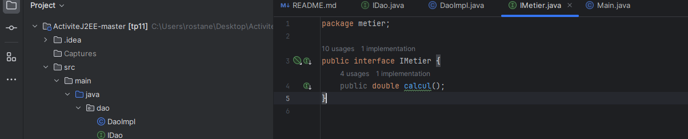
<h4>4-Créer une implémentation de cette interface en utilisant le couplage faible</h4>
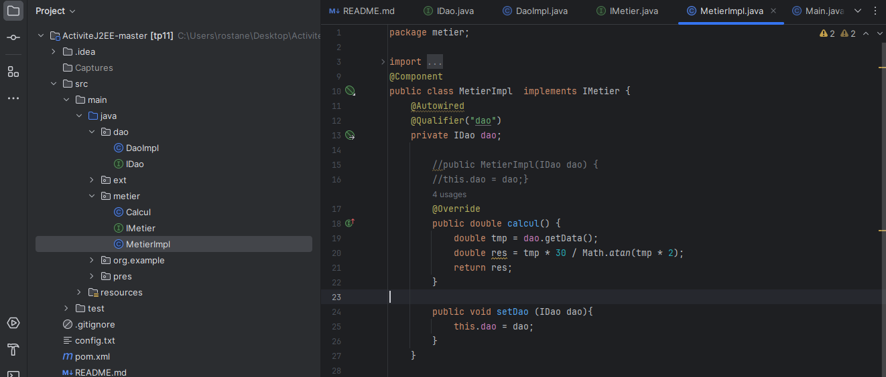
<h4>5-Faire l'injection des dépendances </h4>
<h5>----Par instanciation Statique----</h5>

*Deuxieme implementation de l'interface IDAO*

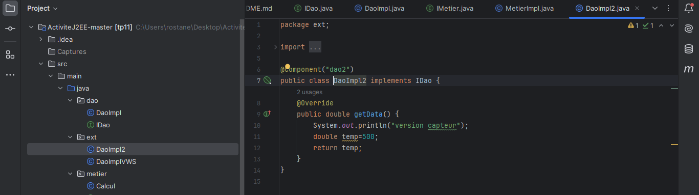

*Instanciation statique*

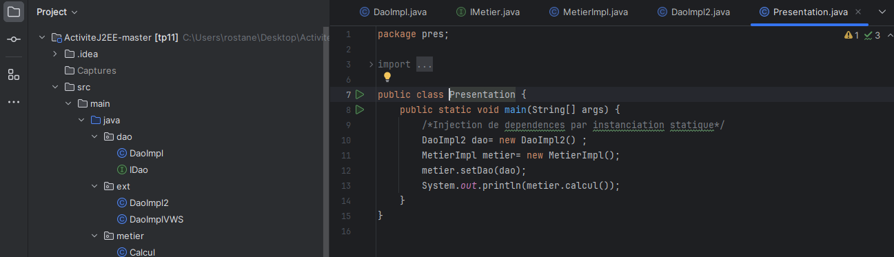

*Excecution*

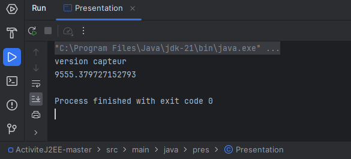
<h5>----Dynamique----</h5>

*Config.txt*

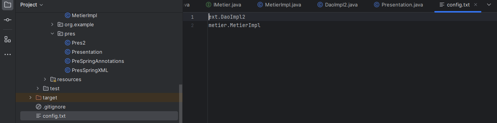

*Instanciation Dynamique*

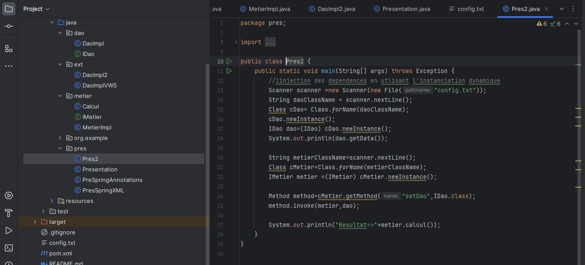

*Execution*

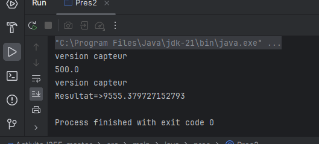
<h5>----Spring Framework----</h5>
<h6>Injection de dependances Version XML</h6>

*Application Context*

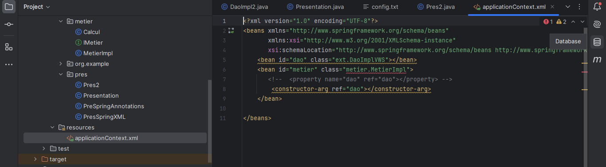

*Injection de dependances*

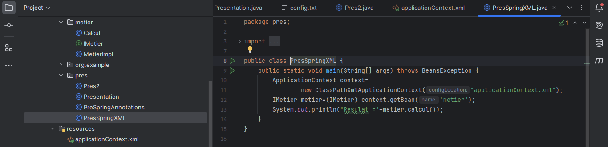

*Execution*

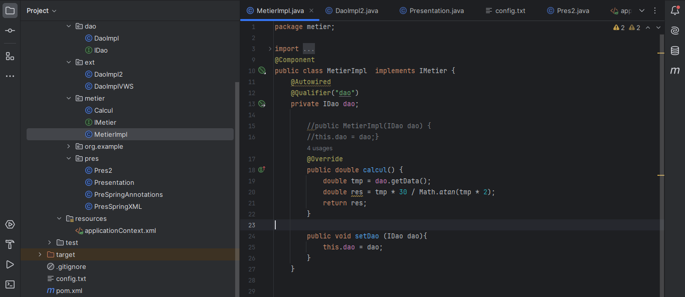
<h6>Injection de dependances Version Annotation</h6>

*Utilisation d'annotations sur l'implementation de l'interface Metier*

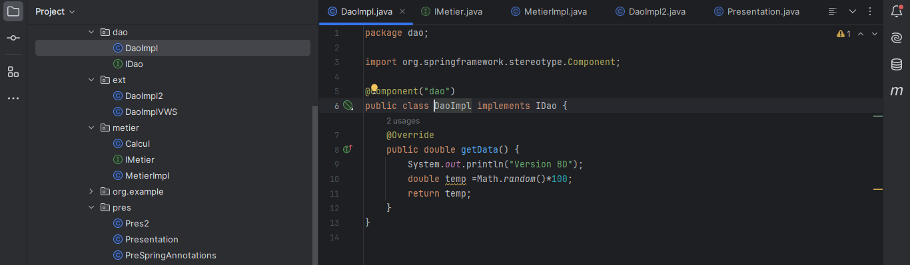

*Utilisation d'annotations sur l'implementation de l'interface DAO*

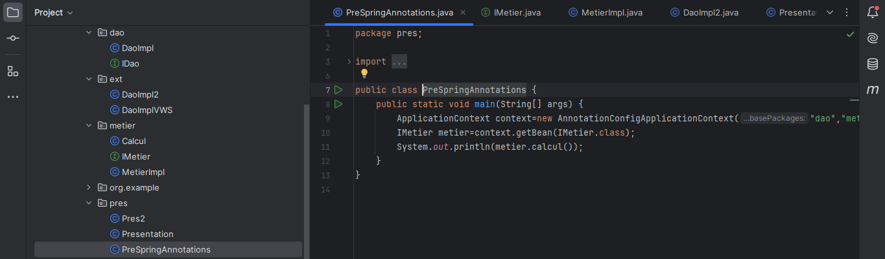

*Injection de dependances*

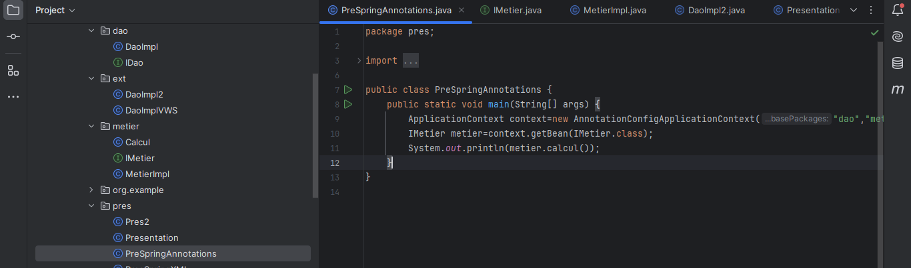

*Execution*

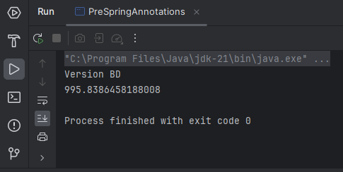
